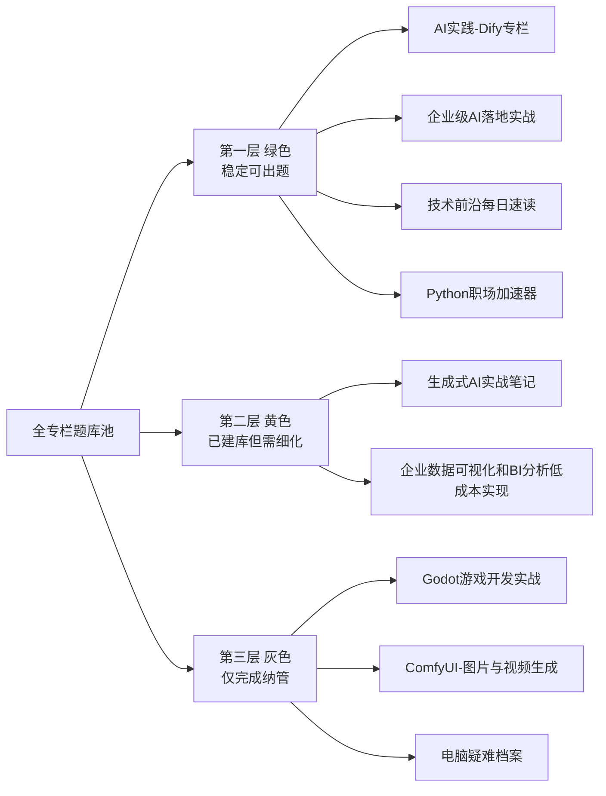

# CSDN专栏题库总览（可视化版）

目标：让你一眼看出每个专栏现在处于哪一层，而不是只看抽象描述。

判定口径：
- 第一层：已能稳定消费库存
- 第二层：已建库，但模块蓝图偏泛化，仍需细化
- 第三层：已纳管，但模块结构还很粗，只完成了“先建库”

## 1. 一眼总览表

| 层级 | 含义 | 专栏 | 当前状态 | 你的直观理解 |
|---|---|---|---|---|
| 第一层 | 可以直接持续出题 | AI实践-Dify专栏 | 模块清楚，库存可直接消耗 | 已经像“正式专栏编辑部” |
| 第一层 | 可以直接持续出题 | 企业级AI落地实战：从模型部署到应用系统 | 模块成形，案例层还可继续补 | 已经能排产，但还能加厚 |
| 第一层 | 可以直接持续出题 | 技术前沿每日速读 | 引流模板明确，可持续出题 | 已经像“固定栏目” |
| 第一层 | 可以直接持续出题 | Python职场加速器：实战技巧与高效工具集 | 主线已拆出两块 | 可以开始稳定补系列 |
| 第二层 | 已建库但还不够像“本专栏专属题库” | 生成式AI实战笔记 | 有模块，但还偏借用相邻AI专栏逻辑 | 有框架，但不够贴脸 |
| 第二层 | 已建库但还不够像“本专栏专属题库” | 企业数据可视化和BI分析低成本实现 | 有模块，但像通用技术题库 | 已纳管，但还没长出专栏味 |
| 第三层 | 只完成了纳管，结构颗粒仍粗 | Godot 游戏开发实战：从新手到上架发布 | 只有粗模块 | 有库存，但还没拆系列 |
| 第三层 | 只完成了纳管，结构颗粒仍粗 | ComfyUI-图片与视频生成 | 只有粗模块 | 有库存，但还没拆系列 |
| 第三层 | 只完成了纳管，结构颗粒仍粗 | 电脑疑难档案 | 只有粗模块 | 有库存，但还没拆系列 |

## 2. 用颜色块思维来理解

你可以把现在所有专栏想成 3 种颜色：

- 绿色 = 第一层 = 现在就能稳定出题
- 黄色 = 第二层 = 已经建库，但还需要“长成自己”
- 灰色 = 第三层 = 先纳入系统了，但还没精细化

对应如下：

绿色（成熟可用）
- AI实践-Dify专栏
- 企业级AI落地实战：从模型部署到应用系统
- 技术前沿每日速读
- Python职场加速器：实战技巧与高效工具集

黄色（已成形但不够专属）
- 生成式AI实战笔记
- 企业数据可视化和BI分析低成本实现

灰色（已纳管但还没细拆）
- Godot 游戏开发实战：从新手到上架发布
- ComfyUI-图片与视频生成
- 电脑疑难档案

## 3. Mermaid 可视化图

## 4. 为什么你会对第二层、第三层没概念

因为它们的区别不是“有没有题库”，而是“题库是不是已经足够像一个专栏自己的系列树”。

第二层：
- 已经不是空白
- 已经有模块
- 但模块还是偏泛，像“先借了邻近领域的骨架”
- 所以看起来有内容，但你不一定能一眼感到“这就是这个专栏该写的下一批”

第三层：
- 只是先把专栏拉进系统里
- 让它不再游离在管理体系外
- 但还没拆出像样的“篇目树”
- 所以它更像“登记入册”，还不像“完成编目”

## 5. 一个更直观的类比

你可以把 3 层理解成图书馆整理进度：

- 第一层：已经分好书架、类别、标签，读者可以直接借书
- 第二层：书已经上架，但分类还不够细，找书有点费劲
- 第三层：书已经搬进图书馆，但还只是先堆在对应区域，没做细目录

## 6. 你接下来最容易做判断的方式

以后你只要问自己 3 个问题：

1. 这个专栏现在有没有稳定模块？
2. 每个模块下面有没有 unused 候选题？
3. 这些候选题看起来像不像“这个专栏应该写的下一批”？

如果三个答案都是“有”，那就是第一层。
如果前两个是“有”，第三个不明显，就是第二层。
如果只有第一个还很模糊，基本就是第三层。

## 7. 当前建议

如果你要继续推进系统建设，最值得优先处理的是：
- 先把第二层专栏做成第一层
- 再把第三层专栏做成第二层

也就是先处理：
1. 生成式AI实战笔记
2. 企业数据可视化和BI分析低成本实现

再处理：
3. Godot
4. ComfyUI
5. 电脑疑难档案
